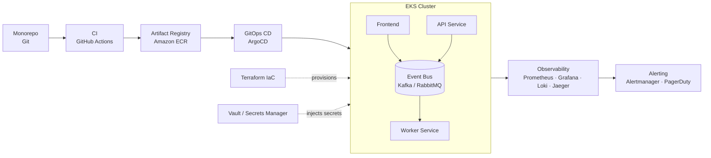

<!--
  Take a screenshot of devops-roadmap.html (full page, ~1240px wide),
  save it as docs/roadmap-banner.png in your repo, and it will render here.
-->

# Event-Driven E-Commerce — DevOps Roadmap

**From monorepo to a self-healing, observable AWS EKS platform**

---

## Progress

| Phase | Status |
|---|---|
| 1. Source & version control | ✅ Done |
| 2. Continuous integration (CI) | ✅ Done |
| 3. Artifact & dependency management | ⬜ Next |
| 4. Infrastructure as code (IaC) | ⬜ Not started |
| 5. Secrets & config management | ⬜ Not started |
| 6. Continuous delivery & GitOps | ⬜ Not started |
| 7. Orchestration & event-driven services | ⬜ Not started |
| 8. Observability | ⬜ Not started |
| 9. Scaling & load testing | ⬜ Not started |
| 10. SRE & reliability | ⬜ Not started |
| 11. Security (DevSecOps) | ⬜ Not started |

## Table of contents

- [Overview](#overview)
- [Architecture](#architecture)
- [Phase 1 — Source & version control (done)](#phase-1--source--version-control-done)
- [Phase 2 — Continuous integration (done)](#phase-2--continuous-integration-done)
- [Roadmap (phases 3–11)](#roadmap-phases-311)
- [Why this roadmap](#why-this-roadmap)

---

## Overview

This repo documents the DevOps pipeline for an **event-driven e-commerce platform** — microservices (`api`, `worker`, `frontend`) that communicate asynchronously through a durable event bus, deployed to **AWS EKS** with GitOps, and observed end-to-end with metrics, logs, and distributed tracing.

## Architecture

> GitHub renders Mermaid diagrams natively — no image export needed for this one.

---

## Phase 1 — Source & version control (done)

**Goal:** organize a working monorepo into a structure that supports real DevOps workflows — protected branches, mandatory PR reviews, and clean separation between services and infra.

### What was done

- Reorganized services into `app/api`, `app/worker`, `app/frontend`, each with its own `Dockerfile` and dependencies
- Kept infrastructure code isolated under `infra/terraform`
- Removed stray/accidental files from the repo
- Added a root `.gitignore` covering Python caches, `.env`, `.terraform/`, and Terraform state files
- Enabled **branch protection on `main`**: pull requests are required before merging, direct pushes are rejected
- Added a `.github/CODEOWNERS` file mapping each service/infra folder to an owner, with **"Require review from Code Owners"** enabled
- Practiced the actual trunk-based flow end-to-end: feature branch → PR → merge, instead of pushing straight to `main`

### Lessons learned

- **`git push origin main` was rejected** once branch protection was enabled (`GH006: Protected branch update failed`) — the protection working as intended, forcing branch → PR → merge.
- **A PR author cannot approve their own PR** on GitHub. As a solo developer this blocks merging even with an otherwise-correct setup — solved with an admin bypass while keeping the rule itself active, since a real team would have a second reviewer.
- Trunk-based branching and Conventional Commits are **habits enforced by the branch rule**, not configuration completed once.

---

## Phase 2 — Continuous integration (done)

**Goal:** every service (`api`, `worker`, `frontend`) automatically builds, tests, and gets security-scanned on every push and pull request — before any of it reaches `main`.

### What was done

**`api` service**
- Added `test/test_smoke.py` and a GitHub Actions workflow (`.github/workflows/api-ci.yml`) that installs dependencies, runs `pytest`, and verifies a Docker build
- Cleaned up a messy `requirements.txt` full of duplicate entries; split dev-only tools (`pytest`) into `requirements-dev.txt`

**`worker` service**
- Same pattern: `test/test_smoke.py` + `.github/workflows/worker-ci.yml`
- Refactored `worker.py` so the Redis-consuming logic is testable without a live Redis connection

**`frontend` service**
- Rebuilt the Dockerfile around `nginx:alpine` instead of Python's bare `http.server`: non-root user, `HEALTHCHECK`, and runtime environment-variable injection for the API URL (so the same image can move between dev/staging/prod without a rebuild)
- Added `.github/workflows/frontend-ci.yml`: HTML validation, Docker build, and a **Trivy vulnerability scan** that fails the pipeline on critical/high CVEs

### What each CI pipeline actually does

1. Installs dependencies (with pip caching for speed)
2. Runs the test suite
3. Builds the Docker image to verify the Dockerfile is valid
4. (`frontend` only, for now) scans the built image for known vulnerabilities and blocks the merge if any critical/high CVE has no justification

### Bugs found and fixed along the way (the real learning)

- **A test that imported a live database connection.** `models.Base.metadata.create_all(bind=engine)` was running at module import time in `main.py` — so `from main import app` in a test tried to connect to a database that doesn't exist in CI. Fixed by moving it into a FastAPI startup event. *Lesson: importing code and running code are not the same thing.*
- **A worker that would hang forever if imported.** `worker.py` had its entire `while True` polling loop at module level. Refactored into `get_redis_client()`, `process_order()`, and `run_worker_loop()`, gated behind `if __name__ == "__main__":` — now the core logic is unit-testable in isolation.
- **A file created locally but never committed.** CI failed with `No such file or directory: requirements-dev.txt` — a direct reminder that CI only sees what's actually pushed to the repo, not what exists on a laptop.
- **A pinned GitHub Action with a version that no longer existed.** `aquasecurity/trivy-action@0.24.0` failed to resolve after the project migrated its release tags (following a supply-chain security incident upstream) — updated to `@v0.36.0`. *Lesson: pin third-party Actions to a specific version, and expect to revisit that pin.*
- **A real vulnerability scan, doing its job.** First Trivy run on the `frontend` image found 35 vulnerabilities (2 critical) — all inherited from OS packages in the `nginx:alpine` base image, not from application code. Fixed with `apk upgrade` in the Dockerfile.
- **Two small but very real Dockerfile syntax bugs**, both caught by CI before they could reach `main`: a duplicated `FROM` line, and a `HEALTHCHECK` instruction broken across two lines with a bad line continuation, which briefly left the `ENTRYPOINT` missing entirely.

None of these were feature bugs. All of them were exactly the kind of thing that ships silently without CI, and gets caught immediately with it.

---

## Roadmap (phases 3–11)

### 3. Artifact & dependency management — next up
- Push each service's Docker image to a real registry, replacing today's "build-only, verify, don't push" CI step
- Semantic versioning per service, signed images, automated dependency updates

**Tools:** `Amazon ECR` · `Cosign` · `Dependabot`

### 4. Infrastructure as code (IaC)
- Extend the existing `infra/terraform` (VPC already scaffolded) to provision IAM roles and an EKS cluster
- Remote state with locking

**Tools:** `Terraform` · `AWS (IAM/EKS)` · `S3 + DynamoDB`

### 5. Secrets & config management
- No plaintext credentials in the repo; secrets synced into pods at runtime

**Tools:** `HashiCorp Vault` / `AWS Secrets Manager` · `External Secrets Operator`

### 6. Continuous delivery & GitOps
- `dev → staging → prod` promotion, canary/blue-green rollouts with auto-rollback

**Tools:** `ArgoCD` · `Argo Rollouts` · `Helm`

### 7. Orchestration & event-driven services
- `api`, `worker`, `frontend` on EKS communicating through a durable event bus

**Tools:** `Kubernetes (EKS)` · `Kafka` / `RabbitMQ` · `Istio` (optional mesh)

### 8. Observability
- Correlated metrics, logs, and traces across every service

**Tools:** `Prometheus` · `Grafana` · `Loki` · `OpenTelemetry` + `Jaeger`

### 9. Scaling & load testing
- Queue-length-based autoscaling, load simulation before releases

**Tools:** `HPA` / `VPA` · `KEDA` · `Locust` / `k6`

### 10. SRE & reliability
- SLO/SLI tracking, alert routing, deliberate failure injection

**Tools:** `Alertmanager` · `PagerDuty` · `Chaos Mesh` / `Litmus`

### 11. Security (DevSecOps)
- Security enforced at every layer; admission control blocks bad configs before they reach the cluster
- Extend the Trivy scanning already running on `frontend` to `api` and `worker`, plus a scheduled weekly re-scan of running images

**Tools:** `OPA` / `Kyverno` · `Network Policies` · `IAM least-privilege`

## Why this roadmap

<strong>End-to-end ownership</strong>

Covers the full lifecycle — from a commit to an incident response — not just "how to deploy."

<strong>Event-driven maturity</strong>

Uses a durable broker (Kafka/RabbitMQ) instead of plain pub/sub, with reasoning behind the trade-off.

<strong>Security baked in</strong>

Vault, image signing, and policy-as-code from day one — not retrofitted later. The Trivy scan in Phase 2 already caught 35 real vulnerabilities before anything shipped.

<strong>Observability-first</strong>

Metrics, logs, and traces are correlated, not siloed — a signal of senior-level system thinking.

---

Built as a hands-on DevOps practice project — event-driven e-commerce, monorepo → AWS EKS.

# OIDC setup complete - testing ECR push
# Phase 3 OIDC test - final check
# Phase 3 Complete - ECR push with OIDC verified
# ECR verification test
