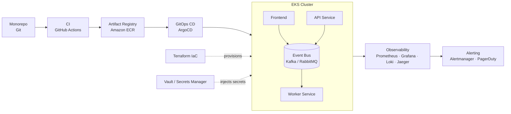

<div align="center">

<!--
  Take a screenshot of devops-roadmap.html (full page, ~1240px wide),
  save it as docs/roadmap-banner.png in your repo, and it will render here.
-->


# Event-Driven E-Commerce — DevOps Roadmap

**From monorepo to a self-healing, observable AWS EKS platform**

[](https://www.terraform.io/)
[](https://kubernetes.io/)
[](https://argo-cd.readthedocs.io/)
[](https://kafka.apache.org/)
[](https://prometheus.io/)
[](https://www.vaultproject.io/)
[](./LICENSE)

</div>

---

## Progress

| Phase | Status |
|---|---|
| 1. Source & version control | ✅ Done |
| 2. Continuous integration (CI) | ⬜ Next |
| 3. Artifact & dependency management | ⬜ Not started |
| 4. Infrastructure as code (IaC) | ⬜ Not started |
| 5. Secrets & config management | ⬜ Not started |
| 6. Continuous delivery & GitOps | ⬜ Not started |
| 7. Orchestration & event-driven services | ⬜ Not started |
| 8. Observability | ⬜ Not started |
| 9. Scaling & load testing | ⬜ Not started |
| 10. SRE & reliability | ⬜ Not started |
| 11. Security (DevSecOps) | ⬜ Not started |

## Table of contents

- [Overview](#overview)
- [Architecture](#architecture)
- [Phase 1 — Source & version control (done)](#phase-1--source--version-control-done)
- [Roadmap (phases 2–11)](#roadmap-phases-211)
- [Why this roadmap](#why-this-roadmap)

---

## Overview

This repo documents the DevOps pipeline for an **event-driven e-commerce platform** — microservices (`api`, `worker`, `frontend`) that communicate asynchronously through a durable event bus, deployed to **AWS EKS** with GitOps, and observed end-to-end with metrics, logs, and distributed tracing.

## Architecture



> GitHub renders Mermaid diagrams natively — no image export needed for this one.

---

## Phase 1 — Source & version control (done)

**Goal:** organize a working monorepo into a structure that supports real DevOps workflows — protected branches, mandatory PR reviews, and clean separation between services and infra.

### What was done

- Reorganized services into `app/api`, `app/worker`, `app/frontend`, each with its own `Dockerfile` and dependencies
- Kept infrastructure code isolated under `infra/terraform`
- Removed stray/accidental files from the repo (e.g. a leftover `1` file inside `app/api`)
- Added a root `.gitignore` covering Python caches, `.env`, `.terraform/`, and Terraform state files
- Pushed the cleaned-up monorepo to GitHub
- Enabled **branch protection on `main`**: pull requests are required before merging, direct pushes are rejected
- Added a `.github/CODEOWNERS` file mapping each service/infra folder to an owner, and enabled **"Require review from Code Owners"**
- Practiced the actual trunk-based flow end-to-end: created a `feature/add-codeowners` branch, opened a PR, and merged through GitHub instead of pushing straight to `main`

### Lessons learned (worth mentioning in an interview)

- **`git push origin main` was rejected** once branch protection was enabled (`GH006: Protected branch update failed`) — this is the protection working as intended, not a bug. It forced the correct fix: branch → PR → merge.
- **A PR author cannot approve their own PR** on GitHub. As a solo developer this blocks merging even with an otherwise-correct setup. Kept the "require approval" rule active anyway (rather than disabling it) and merge via **admin bypass** for now, since the rule itself is the thing worth demonstrating — a real team would have a second reviewer.
- Trunk-based branching and Conventional Commits aren't one-time setup steps — they're **habits enforced by the branch rule**, not configuration completed once and forgotten.

### Repo structure (current)

```
microservices-ecommerce-engine/
├── app/
│   ├── api/               # core service — database.py, main.py, models.py, schemas.py, security.py, worker.py
│   │   ├── Dockerfile
│   │   └── requirements.txt
│   ├── worker/             # background job processor
│   │   ├── Dockerfile
│   │   ├── requirements.txt
│   │   └── worker.py
│   └── frontend/
│       ├── Dockerfile
│       └── index.html
├── infra/
│   └── terraform/
│       ├── provider.tf
│       ├── variables.tf
│       └── vpc.tf
├── scripts/
├── docker-compose.yml
├── .gitignore
├── .github/
│   └── CODEOWNERS
└── README.md
```

---

## Roadmap (phases 2–11)

### 2. Continuous integration (CI) — next up
- Lint → unit tests → integration tests, run separately for `api`, `worker`, `frontend`
- Multi-stage Docker builds
- Image vulnerability scan before merge

**Tools:** `GitHub Actions` · `Docker` · `Trivy` · `SonarQube`

### 3. Artifact & dependency management
- Semantic versioning per service, signed images, automated dependency updates

**Tools:** `Amazon ECR` · `Cosign` · `Dependabot`

### 4. Infrastructure as code (IaC)
- Extend the existing `infra/terraform` (VPC already scaffolded) to provision IAM roles and an EKS cluster
- Remote state with locking

**Tools:** `Terraform` · `AWS (IAM/EKS)` · `S3 + DynamoDB`

### 5. Secrets & config management
- No plaintext credentials in the repo; secrets synced into pods at runtime

**Tools:** `HashiCorp Vault` / `AWS Secrets Manager` · `External Secrets Operator`

### 6. Continuous delivery & GitOps
- `dev → staging → prod` promotion, canary/blue-green rollouts with auto-rollback

**Tools:** `ArgoCD` · `Argo Rollouts` · `Helm`

### 7. Orchestration & event-driven services
- `api`, `worker`, `frontend` on EKS communicating through a durable event bus

**Tools:** `Kubernetes (EKS)` · `Kafka` / `RabbitMQ` · `Istio` (optional mesh)

### 8. Observability
- Correlated metrics, logs, and traces across every service

**Tools:** `Prometheus` · `Grafana` · `Loki` · `OpenTelemetry` + `Jaeger`

### 9. Scaling & load testing
- Queue-length-based autoscaling, load simulation before releases

**Tools:** `HPA` / `VPA` · `KEDA` · `Locust` / `k6`

### 10. SRE & reliability
- SLO/SLI tracking, alert routing, deliberate failure injection

**Tools:** `Alertmanager` · `PagerDuty` · `Chaos Mesh` / `Litmus`

### 11. Security (DevSecOps)
- Security enforced at every layer; admission control blocks bad configs before they reach the cluster

**Tools:** `OPA` / `Kyverno` · `Network Policies` · `IAM least-privilege`

## Why this roadmap

<details>
<summary><strong>End-to-end ownership</strong></summary>
Covers the full lifecycle — from a commit to an incident response — not just "how to deploy."
</details>

<details>
<summary><strong>Event-driven maturity</strong></summary>
Uses a durable broker (Kafka/RabbitMQ) instead of plain pub/sub, with reasoning behind the trade-off.
</details>

<details>
<summary><strong>Security baked in</strong></summary>
Vault, image signing, and policy-as-code from day one — not retrofitted later.
</details>

<details>
<summary><strong>Observability-first</strong></summary>
Metrics, logs, and traces are correlated, not siloed — a signal of senior-level system thinking.
</details>

---

<div align="center">
<sub>Built as a hands-on DevOps practice project — event-driven e-commerce, monorepo → AWS EKS.</sub>
</div>
#

